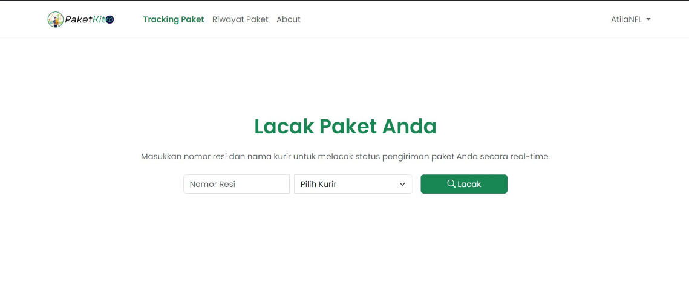
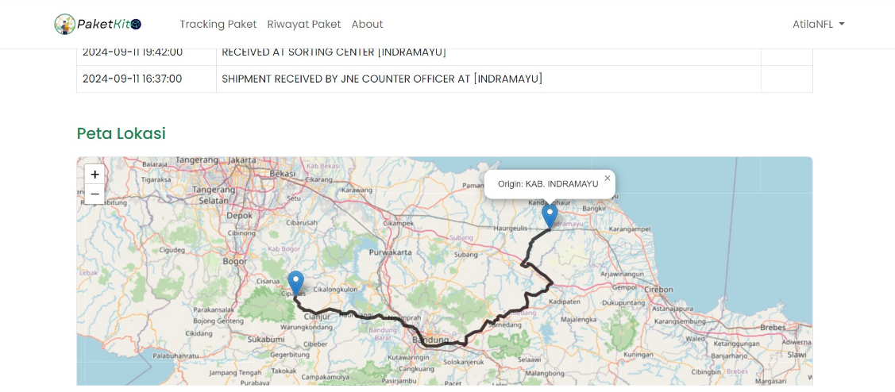
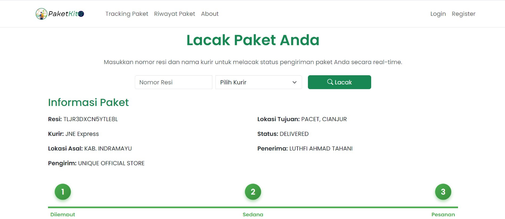
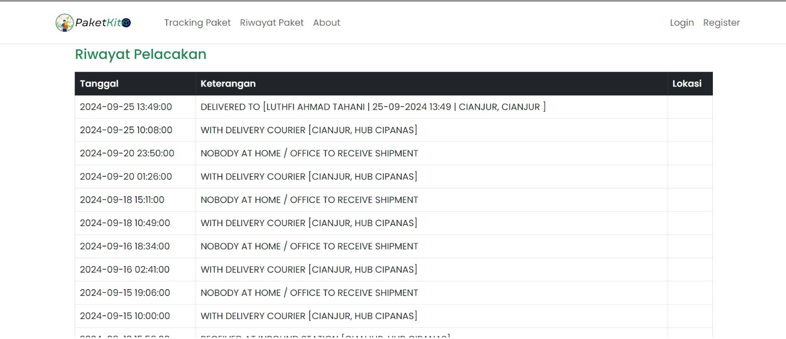
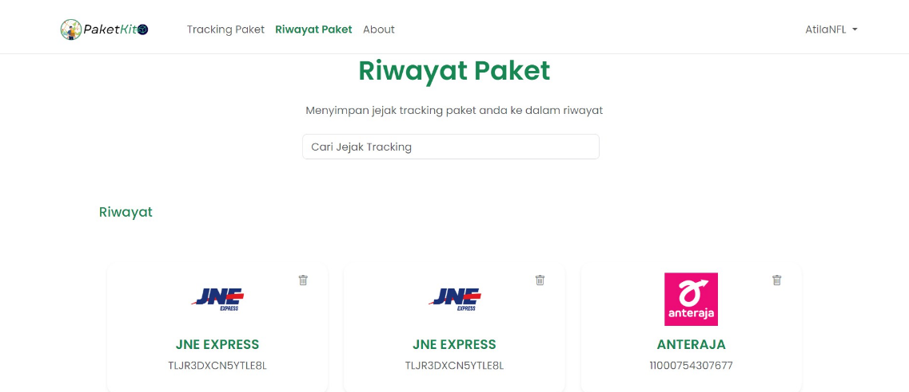
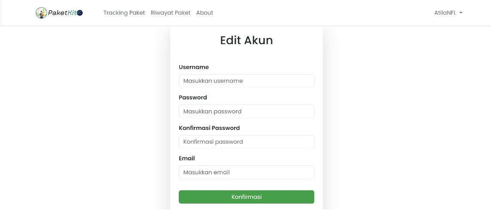
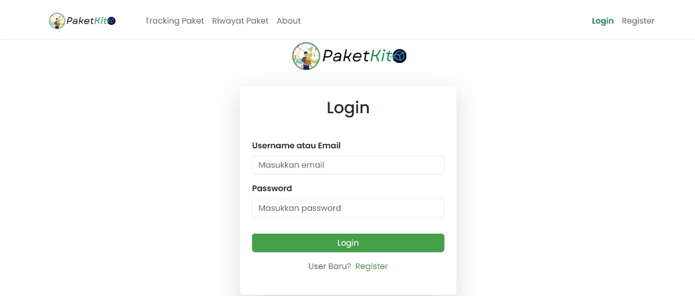
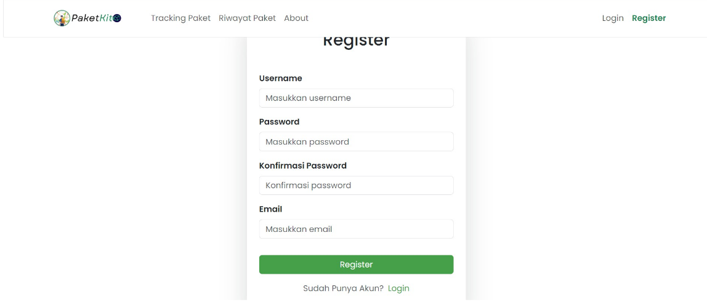

# 📦 PaketKita — Real-Time Parcel Tracking Platform

[](https://laravel.com)
[](https://php.net)
[](https://vitejs.dev)
[](https://leafletjs.com)
[](LICENSE)

**PaketKita** is a premium, web-based parcel tracking platform designed to provide users with a seamless, real-time visual monitoring experience of their package deliveries. Integrated with the **BinderByte API** for real-time tracking data and utilizing **LeafletJS** for interactive visual map routing, the platform enables users to track shipments across multiple courier services in Indonesia (e.g., JNE, J&T, SiCepat, Anteraja) from origin to destination.

---

## 🚀 Core Features

- 🔍 **Real-Time Tracking:** Query the status of your shipments using the Air Waybill (AWB) number and selected courier service via the BinderByte API.
- 🗺️ **Interactive Geographic Mapping:** Visualize package origin, destination, current status, and transit checkpoints on an interactive map powered by **LeafletJS**.
- 📋 **Detailed Shipping Chronology:** Access detailed logs of package history, including timestamps, location details, and shipping status updates.
- 🔐 **Secure Account Management:** Register, login, manage account information (edit credentials, change passwords), or safely erase accounts using Laravel's secure authentication mechanisms.
- 💾 **Personal Tracking History:** Registered users can save their searched packages to their accounts for easy status updates without re-entering the AWB number.
- ⚡ **Instant Search Filter:** Real-time client-side search functionality using vanilla JavaScript to instantly filter saved package cards on the dashboard.

---

## 🛠️ Technology Stack

- **Backend Framework:** Laravel 10.x (PHP 8.1+)
- **Frontend Compiler:** Vite 5.x & Laravel Vite Plugin
- **Frontend Libraries:** Bootstrap 5 (CSS & JS), LeafletJS 1.9.4
- **API Integration:** BinderByte API (Courier Tracking API)
- **Database Engine:** MySQL / MariaDB

---

## 📐 System Architecture & Design

### Use Case Scenario
1. **Unregistered/Guest User:** Can perform basic real-time package tracking. Tracking history is temporary and will be cleared once the session terminates.
2. **Registered User:** Logs in, inputs an AWB number and selects a courier. The system queries the API, displays the current parcel status and Leaflet map, and saves the tracking info to the database. The user can view, search, and delete records from their dashboard at any time.

### Database Specification
The database `paketkita` utilizes two main tables:

#### 1. `UserAcc` Table
Stores user credentials and profile details.
| Field | Type | Attributes | Description |
|---|---|---|---|
| `id` | INT(11) | Primary Key, Auto Increment, Unique | Unique identifier for each user |
| `username` | VARCHAR(255) | Not Null, Unique | User's handle name |
| `email` | VARCHAR(255) | Not Null, Unique | User's registered email |
| `password` | VARCHAR(255) | Not Null | Hashed password |

#### 2. `TrackingData` Table
Stores parcel tracking details associated with registered users.
| Field | Type | Attributes | Description |
|---|---|---|---|
| `track_id` | INT(11) | Primary Key, Auto Increment, Unique | Unique tracking entry identifier |
| `user_id` | INT(11) | Foreign Key, Not Null | Links to `UserAcc.id` |
| `awb` | CHAR(100) | Not Null | Air Waybill / Tracking number |
| `courier` | VARCHAR(100) | Not Null | Courier name (e.g., `jne`, `jnt`) |
| `status` | VARCHAR(100) | Not Null | Current shipping status (e.g., `DELIVERED`, `ON PROCESS`) |
| `origin` | TEXT | Not Null | Origin address/city |
| `destination` | TEXT | Not Null | Destination address/city |
| `shipper` | VARCHAR(255) | Not Null | Shipper's name |
| `receiver` | VARCHAR(255) | Not Null | Receiver's name |
| `date` | TEXT | Not Null | Array of checkpoint timestamps (JSON format) |
| `description` | TEXT | Not Null | Array of checkpoint descriptions (JSON format) |
| `location` | TEXT | Not Null | Array of checkpoint locations (JSON format) |

---

## 💾 Database Schema Setup (SQL)

If you need to initialize the tables manually in your MySQL instance, use the following SQL script:

```sql
CREATE DATABASE IF NOT EXISTS `paketkita`;
USE `paketkita`;

CREATE TABLE IF NOT EXISTS `UserAcc` (
  `id` INT(11) NOT NULL AUTO_INCREMENT,
  `username` VARCHAR(255) NOT NULL,
  `email` VARCHAR(255) NOT NULL,
  `password` VARCHAR(255) NOT NULL,
  PRIMARY KEY (`id`),
  UNIQUE KEY `email` (`email`),
  UNIQUE KEY `username` (`username`)
) ENGINE=InnoDB DEFAULT CHARSET=utf8mb4;

CREATE TABLE IF NOT EXISTS `TrackingData` (
  `track_id` INT(11) NOT NULL AUTO_INCREMENT,
  `user_id` INT(11) NOT NULL,
  `awb` CHAR(100) NOT NULL,
  `courier` VARCHAR(100) NOT NULL,
  `status` VARCHAR(100) NOT NULL,
  `origin` TEXT NOT NULL,
  `destination` TEXT NOT NULL,
  `shipper` VARCHAR(255) NOT NULL,
  `receiver` VARCHAR(255) NOT NULL,
  `date` TEXT NOT NULL,
  `description` TEXT NOT NULL,
  `location` TEXT NOT NULL,
  PRIMARY KEY (`track_id`),
  KEY `user_id` (`user_id`),
  CONSTRAINT `tracking_data_user_fk` FOREIGN KEY (`user_id`) REFERENCES `UserAcc` (`id`) ON DELETE CASCADE
) ENGINE=InnoDB DEFAULT CHARSET=utf8mb4;
```

---

## ⚙️ Installation & Configuration

### Prerequisites
Before setting up the project, make sure you have the following installed on your machine:
- PHP >= 8.1
- Composer
- Node.js & NPM
- MySQL / MariaDB (e.g., via XAMPP, Laragon, or standalone installations)

### Step 1: Clone the Repository
Clone the codebase to your local storage:
```bash
git clone <repository-url>
cd Paket-Kita
```

### Step 2: Install Dependencies
Run composer to install PHP packages:
```bash
composer install
```

Install node packages for asset compiling:
```bash
npm install
```

### Step 3: Configure Environment Settings
Copy the `.env.example` file to `.env`:
```bash
cp .env.example .env
```

Open `.env` and configure your database settings:
```env
DB_CONNECTION=mysql
DB_HOST=127.0.0.1
DB_PORT=3307          # Set this to your local MySQL port (commonly 3306 or 3307)
DB_DATABASE=paketkita
DB_USERNAME=root
DB_PASSWORD=          # Input your MySQL database password here
```

### Step 4: Key Generation
Generate the Laravel application key:
```bash
php artisan key:generate
```

### Step 5: Database Setup
1. Open your database manager (such as phpMyAdmin, DBeaver, or XAMPP).
2. Create a new database named `paketkita`.
3. Import the database tables using either of the following options:
   - **Option A (Manual SQL):** Execute the SQL script provided in the [Database Schema Setup](#-database-schema-setup-sql) section above inside your new database.
   - **Option B (Laravel Migrations):** If you prefer Laravel migrations, ensure that your migrations reflect the model definitions, then run:
     ```bash
     php artisan migrate
     ```

### Step 6: Asset Compilation
Build resources using Vite:
```bash
# Compile and run development server
npm run dev

# Or build production assets
npm run build
```

---

## 🖥️ Running and Hosting Locally

### 1. Simple Local Dev Server
To fire up the Laravel development server locally:
```bash
php artisan serve
```
Your application will be available at [http://127.0.0.1:8000](http://127.0.0.1:8000).

### 2. Local Virtual Hosting (XAMPP / Apache)
For a cleaner development environment running under a local custom domain name (e.g., `http://paket-kita.local`), configure Apache virtual hosts:

1. Open your Apache `httpd-vhosts.conf` file (located in `C:\xampp\apache\conf\extra\` on Windows).
2. Add the following Virtual Host configuration (adjust paths to match your local installation):
   ```apache
   <VirtualHost *:80>
       DocumentRoot "C:/path/to/Paket-Kita/public"
       ServerName paket-kita.local
       <Directory "C:/path/to/Paket-Kita/public">
           Options Indexes FollowSymLinks
           AllowOverride All
           Require all granted
       </Directory>
   </VirtualHost>
   ```
3. Map the local host address in your system `hosts` file (located in `C:\Windows\System32\drivers\etc\hosts` on Windows, or `/etc/hosts` on Linux/macOS):
   ```hosts
   127.0.0.1    paket-kita.local
   ```
4. Restart Apache on XAMPP and navigate to `http://paket-kita.local` in your web browser.

---

## 🎨 User Interface Showcase

Below is a preview of the PaketKita application in action:

| Screen | Preview |
|---|---|
| **Tracking Input** <br> *Type in the Air Waybill (AWB) and select a courier.* |  |
| **Tracking Status & Live Map** <br> *Visualize the routing and check details on the LeafletJS map.* |  |
| **Active Shipment Status** <br> *Check origin, destination, shipper, and receiver details.* |  |
| **Checkpoint History Log** <br> *Comprehensive timestamps and descriptions for transit history.* |  |
| **Saved Packages Dashboard** <br> *Review previously tracked packages with immediate search filters.* |  |
| **Account Management** <br> *Update username, email, and password from the settings dashboard.* |  |
| **Authentication Screens** <br> *Secure Login and Register forms.* | **Login Page:** <br>  <br><br> **Register Page:** <br>  |

---

## 👥 Development Team

This project was built as part of the Web-Based Computing course at **Universitas Pembangunan Jaya (UPJ)**, Tangerang Selatan (2024).

- 👑 **Athillah Naufal Al-Falah** (NIM: `2023071002`) - Project Lead & Full-Stack Developer
- 💻 **Daffa Ma’ruf** (NIM: `2023071008`) - Front-End Developer & Documentation Writer
- 🎨 **Dava Ferdian Hadiputra** (NIM: `2023071021`) - Front-End Developer & UI/UX Designer

---

## 📄 License

This software is open-sourced and licensed under the [MIT license](LICENSE).

